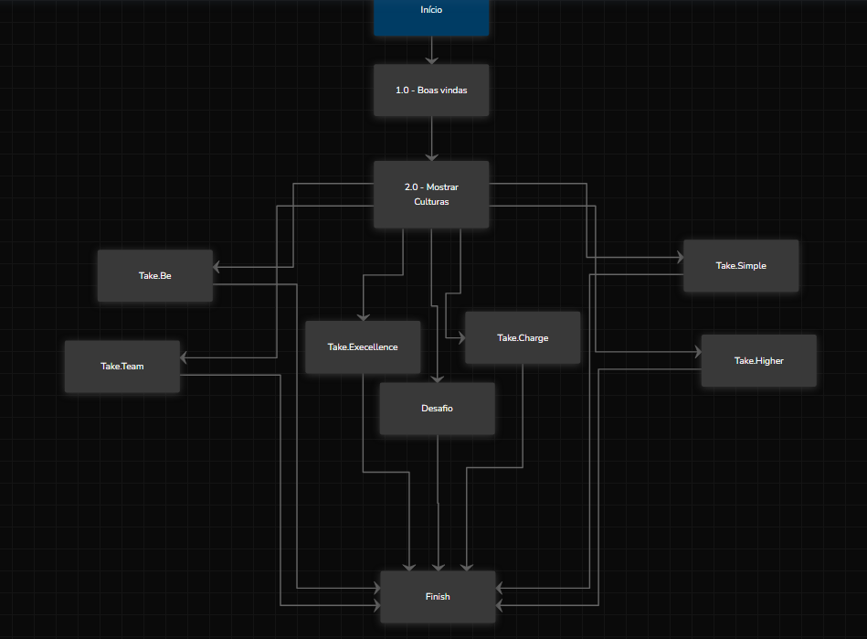

  

# Projeto IA Blip

## Desenvolvimento

Esta API desenvolvida em NestJS permite listar informações sobre os repositórios de linguagem C# mais antigos do GitHub da organização **Takenet**. A API integra com a API pública do GitHub e fornece uma interface RESTful para acessar esses dados...

## Estrutura do Projeto

- **Controller**: Gerencia as requisições HTTP e define os endpoints da API.
- **Service**: Contém a lógica de negócios e faz a integração com a API do GitHub.
- **Module**: Organiza os componentes e serviços dentro do NestJS.

## Endpoints

`GET`
/github

> Retorna uma lista dos 5 repositórios de linguagem C# mais antigos da organização Takenet, ordenados do mais antigo para o mais novo.

Exemplo: curl http://localhost:3000/github

## Documentação Blip

> Arquivo danielteste4.json
